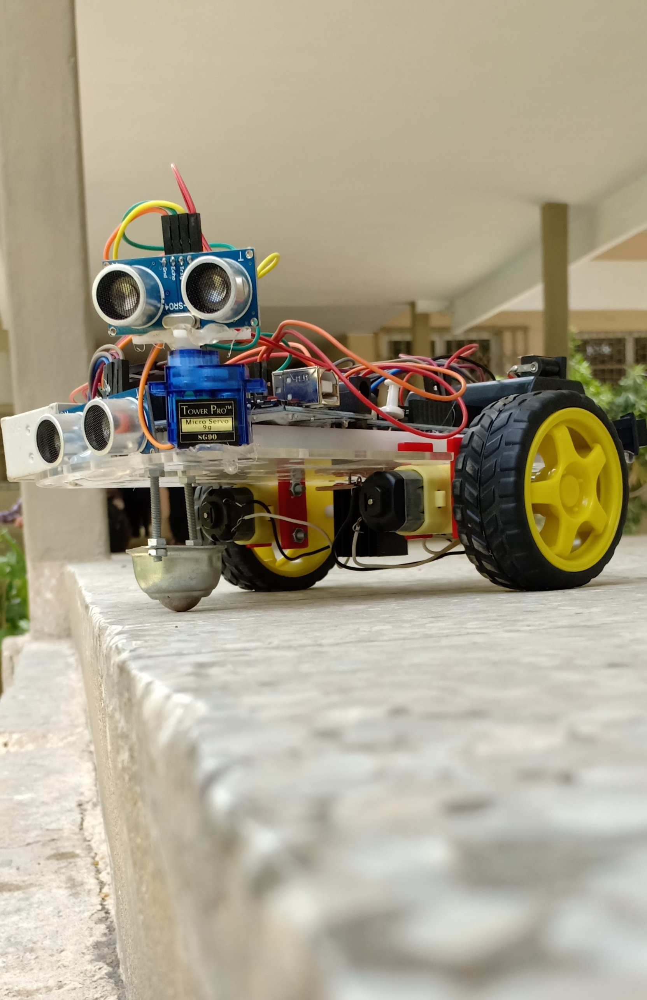

# Hurdle-Detector-Car #

The hurdle detection robot car uses ultrasonic sensors for its movements. A microcontroller of 8051 family is used to achieve the desired operation. The motors are connected through motor driver IC to microcontroller. The ultrasonic sensor is attached in front of the robot.
Whenever the robot is going on the desired path the ultrasonic sensor transmits the ultrasonic waves continuously from its sensor head. Whenever an obstacle comes ahead of it the ultrasonic waves are reflected back from an object and that information is passed to the microcontroller. The microcontroller controls the motors left, right, back, front, based on ultrasonic signals. In order to control the speed of each motor pulse width modulation is used (PWM).
